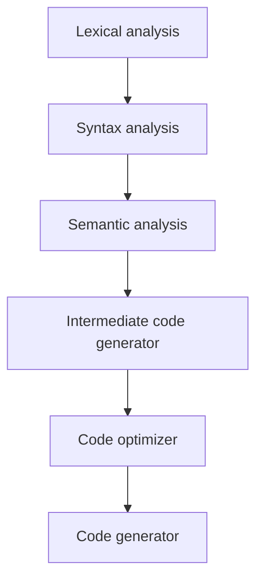

# A small C-like language compiled to LLVM IR

A statically typed scripting language with simple and familiar C-like syntax, mostly built as a fun exercise. Programs are compiled to LLVM IR, which can be run directly with `lli` or compiled to a native binary with `clang`.

## Example Code

```code
func square(x: int): int {
    return x * x;
}

let a: int = 5;
let b: int = 5;

if (a + b < 12) {
    print(a);
} else {
    print(25);
}

let c: int = 0;

while (c < 10) {
    c = c + a;
}
print(c);
print(square(c));

let ratio: double = c / 4.0;
print(ratio);
```

Running the generated IR prints:

```
5
10
100
2.5
```

## Language Features

- **Static types**: `int` (32-bit), `double` (64-bit float) and `bool`, with explicit annotations on every declaration. `int` promotes to `double` implicitly in mixed expressions; everything else is a compile-time type error.
- **Functions**: declared with typed parameters and an explicit return type (`int`, `double`, `bool` or `void`). Declaration order does not matter and recursion works. Non-void functions must return on every path, which the checker proves before any code is generated.
- **Block scoping**: every `{ }` introduces a new scope. An inner `let` may shadow an outer variable; redeclaring a name in the *same* scope is an error. Function bodies see only their own parameters and locals.
- **Operators**: `+ - * /`, comparisons `< > <= >= == !=`, and logical `&& ||` (which require `bool` operands, as do `if`/`while` conditions). The keyword spellings `AND`, `OR` and `NE` are also accepted.
- **`print(expr)`**: prints any non-void value followed by a newline via C's `printf`.

## Usage

```sh
# type-check and print the AST
go run main.go -in=asm/mock -print-ast

# compile to LLVM IR
go run main.go -in=asm/mock -emit-llvm -o asm/mock.ll

# run the IR directly, or compile it to a native binary
lli asm/mock.ll
clang asm/mock.ll -o mock && ./mock
```

Equivalent Makefile targets: `make run`, `make emit`, `make lli`, `make clang`, `make run-bin`, `make test`.

## Compiler Details

The compiler uses LLVM as its backend allowing it to quickly target a wide range of architectures and make use of existing optimisation passes. A compiler typically consists of six stages illustrated below; LLVM handles the final optimisation and native code generation, freeing the frontend from concerns such as register allocation.



Furthermore, since LLVM IR is targeted by many other mature languages such as C/C++ (with the clang compiler), Haskell, Rust and more, this allows us to reuse many of the tools and optimisations developed there. In many ways, LLVM IR can be seen in a similar light to Java byte code; for a more in-depth understanding of the architecture and rationale behind LLVM have a read through [this](http://www.aosabook.org/en/llvm.html).

The pipeline in this repository:

1. **Lexing** (`parser/lexer.go`) — a hand-written scanner that tracks line and column positions for error reporting.
2. **Parsing** (`parser/grammar.y`) — a [goyacc](https://pkg.go.dev/golang.org/x/tools/cmd/goyacc)-generated LALR parser builds a complete AST for the whole program. Parsing has no side effects; the finished tree is handed to the next stage.
3. **Semantic analysis** (`parser/checker.go`) — a static type checker resolves scopes and function signatures, enforces the typing rules, and performs return-path analysis. Nothing is evaluated at compile time except the rejection of division by a literal zero.
4. **Code generation** (`codegen/`) — the type-checked AST is lowered to LLVM IR using [llir/llvm](https://github.com/llir/llvm). Top-level statements become the body of an implicit `main`; `if`/`else` lowers to conditionally branched blocks converging on a merge block, and `while` lowers to a header/body/end block triple with a backedge.

### Context Free Grammar

The grammar is defined in `parser/grammar.y` and compiled with `make parser-gen` (never edit `parser/parser.go` by hand). The shape of it:

```
program :  /* empty */
     | program statement
     | program func_decl
     ;

statement:
     expression SEPARATOR
     | assignment SEPARATOR
     | reassignment SEPARATOR
     | print SEPARATOR
     | return_stmt SEPARATOR
     | control_flow
     | while_statement
     ;

expression:
     NUMBER | TRUE | FALSE | IDENTIFIER
    | IDENTIFIER '(' args ')'
    | expression '+' expression | expression '-' expression
    | expression '*' expression | expression '/' expression
    | expression LT expression  | expression GT expression
    | expression LTE expression | expression GTE expression
    | expression EQ expression  | expression NE expression
    | expression OR expression  | expression AND expression
    | '(' expression ')'
    | '-' expression %prec UMINUS
    ;

assignment:
     LET IDENTIFIER ':' type_name ASSIGN expression
     ;

func_decl:
     FUNC IDENTIFIER '(' params ')' ':' return_type '{' statements '}'
     ;

return_stmt:
     RETURN expression
     | RETURN
     ;

control_flow:
     IF '(' expression ')' '{' statements '}'  %prec NO_ELSE
     | IF '(' expression ')' '{' statements '}' ELSE '{' statements '}'
     ;

while_statement:
     WHILE '(' expression ')' '{' statements '}'
     ;
```

Operator precedence follows C conventions: `||` binds loosest, then `&&`, then comparisons, then `+ -`, then `* /`, then unary minus.

### Error Reporting

Parse errors carry source positions; semantic errors describe the violation:

```
error: variable "b" already defined
error: division by zero
error: undefined variable: d
error: type mismatch: cannot assign double to int variable "a"
error: function "f": not all paths return a value
error: if condition must be bool, got int
```

## Testing

`go test ./...` runs three layers of tests:

- parser tests over the fixtures in `testdata/`
- type-checker tests covering accepted and rejected programs
- execution tests that compile programs and run the generated IR under `lli`, asserting on actual program output (they skip automatically when the LLVM toolchain is not installed)
